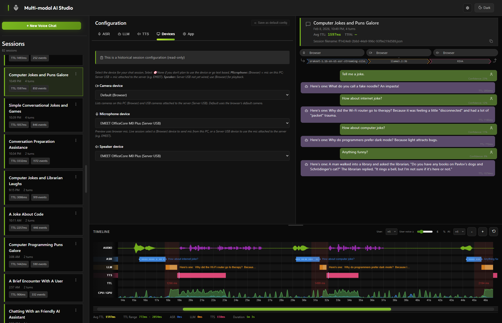

# Multi-modal AI Studio



**Voice, Text, and Video AI Interface with Advanced Performance Analysis**

Multi-modal AI Studio is a next-generation conversational AI interface designed for analyzing and optimizing voice AI systems. Built on NVIDIA Riva, OpenAI APIs, and other backends, it features sophisticated session management, real-time timeline visualization, and comprehensive latency metrics.

## 🌟 Key Features

### Multi-modal Support
- **Voice Input/Output**: Streaming ASR and TTS via Riva or OpenAI
- **Text Chat**: Traditional text-based conversation
- **Video**: Camera feed for vision-enabled models (future)
- **Mixed Modes**: Voice-to-text, text-to-voice, or text-only

### Multi-backend Architecture
- **NVIDIA Riva**: gRPC streaming ASR/TTS
- **OpenAI**: REST API (Whisper, TTS) and Realtime API
- **Azure Speech**: Coming soon
- **Custom backends**: Extensible plugin system

### Session Management
- **Configuration Snapshots**: Every session saves ASR/LLM/TTS configs
- **Timeline Recording**: Store performance data for offline analysis
- **Preset System**: Save and load configuration presets
- **Export/Import**: Generate CLI commands or YAML configs from WebUI

### Performance Analysis
- **Real-time Timeline**: Multi-lane visualization (Audio, Speech, LLM, TTS)
- **Latency Metrics**: TTFA (Time to First Audio), turn-taking analysis
- **Comparison Mode**: Compare multiple sessions to optimize configs
- **Session Replay**: Analyze recorded timeline data

### Flexible Deployment
- **WebUI Mode**: Rich browser interface (default)
- **Headless Mode**: CLI-only for production/automation (not yet implemented)
- **Audio/Video devices**: **Currently supported:** browser devices via WebRTC (mic, speaker, camera through the browser). **Not yet supported:** local USB microphone, USB speaker, or USB webcam attached to the server machine.

## 🚀 Quick Start

### Prerequisites

- Python 3.8+
- **Audio/video**: Use the app in a browser; mic, speaker, and camera are accessed via WebRTC (browser devices). Local USB mic/speaker/webcam on the server are not supported yet.
- NVIDIA Riva (for Riva backend) - see [INSTALL.md](INSTALL.md#nvidia-riva-setup-for-voice-asrtts)
- OpenAI API key (for OpenAI backend) - optional
- **Optional**: `jq` (e.g. `apt install jq` or `brew install jq`) for pretty-formatted LLM request/response logs in the server console; without it, logs use plain JSON

### Installation

Use a virtual environment (e.g. `.venv`) so dependencies stay isolated. Recommended:

```bash
# Clone repository
git clone https://github.com/NVIDIA-AI-IOT/multi_modal_ai_studio.git
cd multi_modal_ai_studio

# Create and activate virtual environment
python3 -m venv .venv
source .venv/bin/activate   # Windows: .venv\Scripts\activate

# Install in development mode
pip install -e .
```

One-line setup (creates `.venv`, installs deps): `./scripts/setup_dev.sh`
Full steps and troubleshooting: [INSTALL.md](INSTALL.md)

### Run WebUI

```bash
# View sessions and timeline (no backend required)
multi_modal_ai_studio --port 8092

# With Riva ASR/TTS (use --asr-server and --tts-server)
multi_modal_ai_studio \
  --port 8092 \
  --asr-server localhost:50051 \
  --tts-server localhost:50051 \
  --llm-api-base http://localhost:11434/v1 \
  --llm-model llama3.2:3b

# With OpenAI Realtime API
multi_modal_ai_studio \
  --port 8092 \
  --asr-scheme openai-realtime \
  --tts-scheme openai-realtime \
  --llm-api-key sk-...

# With preset
multi_modal_ai_studio --preset low-latency
```

Open **http://localhost:8092** in your browser.

**Sessions and sample data**
By default the app loads and saves sessions in `sessions/`. To view or use the sample/mock session JSONs (e.g. in `mock_sessions/`), run with `--session-dir mock_sessions`. Open the app, then click a session in the sidebar to view its config and timeline.

### Run Headless

```bash
# From config file
multi_modal_ai_studio --mode headless --config my-config.yaml

# From CLI args
multi_modal_ai_studio \
  --mode headless \
  --audio-input alsa:hw:0,0 \
  --audio-output alsa:hw:1,0 \
  --asr-scheme riva \
  --llm-model llama3.2:3b
```

## 📖 Documentation

- [Setup Guide](docs/setup.md)
- [Configuration Reference](docs/configuration.md)
- [API Backends](docs/api-backends.md)
- [CLI Reference](docs/cli-reference.md)
- [Presets](docs/presets.md)

## 🏗️ Project Status

**Current Phase**: Foundation (Phase 1)

- [x] Project structure
- [x] Configuration system design
- [x] Cursor rules and documentation
- [ ] Riva backend implementation
- [ ] Basic WebUI
- [ ] Session storage
- [ ] CLI interface

See [docs/cursor/IMPLEMENTATION_PHASES.md](docs/cursor/IMPLEMENTATION_PHASES.md) for roadmap.

## 🤝 Contributing

This project is under active development. Issues, pull requests, and feedback are welcome!

## 📄 License

Apache License 2.0 - See [LICENSE](LICENSE) file for details.

## 🙏 Acknowledgments

Built on top of proven concepts from [Live RIVA WebUI](https://github.com/yourusername/live-riva-webui).
