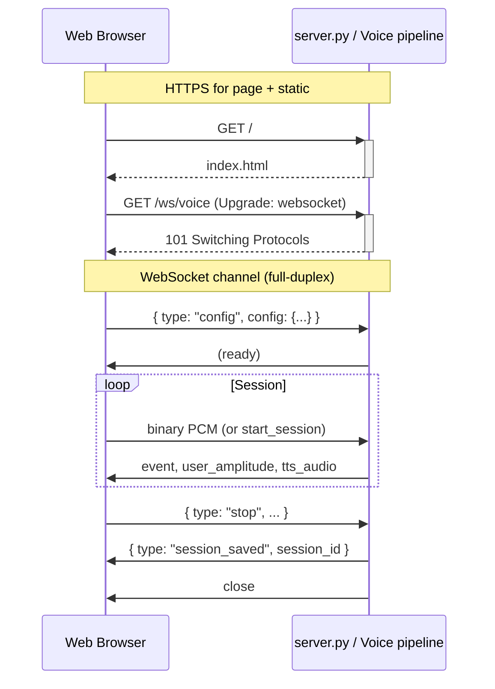

# Multi-modal AI Studio — Internal Logic & Architecture

This document dissects the internal logic and architecture of Multi-modal AI Studio (RIVA ASR/TTS + optional local USB devices). It is intended to support understanding, refactoring, and creating diagrams (e.g. for PPT or Lucidchart) for workshops such as GTC.

**Scope**: Main application flow with ASR and TTS on RIVA, WebUI, and support for browser vs server-side (USB/ALSA) audio devices. Realtime API path is noted where it diverges.

- **PCM path trace (refactored)**: For a step-by-step trace of how **Browser PCM** and **Server USB mic** flow through the pipeline, see [pcm_pipeline_trace.md](pcm_pipeline_trace.md). Per-chunk handling is **refactored**: both inputs use the same **`_feed_pcm_preview_only`** (preview) and **`_feed_pcm_to_pipeline`** (live) in `voice_pipeline.py`; no per-mic duplication.

---

## 1. Repository layout (source)

| Path | Purpose |
|------|--------|
| `src/multi_modal_ai_studio/` | Package root |
| `webui/server.py` | HTTP server, REST APIs, WebSocket routes |
| `webui/voice_pipeline.py` | Voice WebSocket handler: config → PCM → events/TTS; session save |
| `webui/camera_webrtc.py` | Camera WebRTC WebSocket (optional) |
| `webui/static/` | Frontend: `index.html`, `app.js`, `styles.css`, `nvidia-theme.css` |
| `core/session.py` | Session: config, timeline, turns, metrics, save/load JSON |
| `core/timeline.py` | Timeline: events, lanes, TTL/latency calculation |
| `config/schema.py` | Config dataclasses: ASRConfig, LLMConfig, TTSConfig, DeviceConfig, SessionConfig |
| `backends/asr/riva.py` | Riva ASR streaming backend |
| `backends/tts/riva.py` | Riva TTS streaming backend |
| `backends/llm/openai.py` | OpenAI-compatible LLM (Ollama, vLLM, etc.) |
| `backends/realtime/` | OpenAI Realtime API client (full-voice path) |
| `devices/capture.py` | Server-side mic capture (ALSA/pyaudio → queue) |
| `devices/playback.py` | Server-side speaker playback (aplay subprocess) |
| `devices/local.py` | List local cameras and audio devices (USB/ALSA) |
| `cli/main.py` | CLI entry (e.g. `multi-modal-ai-studio --port 8092`) |
| `__main__.py` | Entry point for `python -m multi_modal_ai_studio` |

### 1.1 Directory tree (source)

```
src/multi_modal_ai_studio/
├── __init__.py
├── __main__.py
├── config/
│   ├── __init__.py
│   └── schema.py          # ASRConfig, LLMConfig, TTSConfig, DeviceConfig, SessionConfig
├── core/
│   ├── __init__.py
│   ├── session.py         # Session, Turn, SessionMetrics; save/load JSON
│   └── timeline.py        # Timeline, TimelineEvent, Lane, EventType
├── backends/
│   ├── __init__.py        # Re-exports base classes and result types
│   ├── base.py            # ASRBackend, LLMBackend, TTSBackend (ABCs); ASRResult, LLMToken, TTSChunk
│   ├── asr/
│   │   ├── __init__.py
│   │   └── riva.py        # RivaASRBackend (streaming)
│   ├── tts/
│   │   ├── __init__.py
│   │   └── riva.py        # RivaTTSBackend (streaming)
│   ├── llm/
│   │   ├── __init__.py
│   │   └── openai.py      # OpenAILLMBackend (OpenAI-compatible: Ollama, vLLM, etc.)
│   └── realtime/
│       ├── __init__.py
│       └── client.py      # OpenAI Realtime API client (full-voice WebSocket)
├── devices/
│   ├── __init__.py
│   ├── capture.py         # start_server_mic_capture (ALSA / PyAudio)
│   ├── playback.py        # start_server_speaker_playback (aplay)
│   └── local.py          # list_local_cameras, list_local_audio_inputs/outputs
├── webui/
│   ├── server.py          # aiohttp app, routes, /ws/voice, /ws/mic-preview, /ws/camera-webrtc
│   ├── voice_pipeline.py  # handle_voice_ws, _run_voice_pipeline; ASR→LLM→TTS or Realtime
│   ├── camera_webrtc.py
│   └── static/
│       ├── index.html
│       ├── app.js
│       ├── styles.css
│       └── nvidia-theme.css
├── cli/
│   ├── __init__.py
│   └── main.py            # CLI (--port, --asr-server, presets, etc.)
├── server/                # (optional / legacy)
│   └── __init__.py
└── utils/
    └── __init__.py
```

### 1.2 How backends are managed

- **Base contracts**: `backends/base.py` defines abstract base classes **ASRBackend**, **LLMBackend**, **TTSBackend** and shared types (**ASRResult**, **LLMToken**, **TTSChunk**). All concrete backends implement the same interface (e.g. `send_audio` / `receive_results` for ASR, `generate_stream` for LLM, `synthesize_stream` for TTS).
- **Selection by config**: The voice pipeline does **not** use a registry or plugin loader. It chooses backends from **config only**:
  - **ASR/TTS**: If `asr.scheme == "riva"` and `tts.scheme == "riva"`, it instantiates **RivaASRBackend** and **RivaTTSBackend** (see `voice_pipeline.py`). If `asr.scheme == "openai-realtime"` (and session type full, transport websocket), it runs **OpenAI Realtime** instead and never creates Riva ASR/LLM/TTS for that connection.
  - **LLM**: Always **OpenAILLMBackend** (OpenAI-compatible API) for the classic path; model and `api_base` come from **LLMConfig**.
- **Single implementation per domain**: There is one Riva ASR, one Riva TTS, one OpenAI-compatible LLM, and one Realtime client. Adding a new backend (e.g. Azure ASR) would mean adding a new module under `backends/asr/` (or `tts/`, `llm/`) and a new branch in the pipeline (e.g. `if asr.scheme == "azure": ...`). There is no dynamic discovery of backends.

---

## 2. High-level data flow

**Diagram 1 — System context (one box per “system”)**

- **Browser**: User; captures mic (WebRTC), plays TTS, shows timeline/chat; sends config + PCM (or “start_session” for server mic); on Stop sends `system_stats`, `tts_playback_segments`, `audio_amplitude_history`, `ttl_bands`.
- **Web server (aiohttp)**: Serves static UI; REST for sessions, devices, health, presets; WebSockets: `/ws/voice`, `/ws/mic-preview`, `/ws/camera-webrtc`.
- **Voice pipeline (server)**: One per `/ws/voice` connection: normalizes config, creates Session + Timeline, runs either **Classic (Riva ASR → LLM → Riva TTS)** or **Realtime (OpenAI Realtime WebSocket)**; records events into Session; on disconnect/stop merges client payload into session and saves JSON to `session_dir`.
- **Riva (gRPC)**: ASR and TTS services (host:port).
- **LLM (HTTP)**: OpenAI-compatible API (e.g. Ollama) for chat completion.
- **Local devices**: ALSA/pyaudio for server mic/speaker when `audio_input_source` / `audio_output_source` is `usb` or `alsa`.

**Diagram 2 — Voice pipeline (classic Riva path)**

```
[Browser PCM] or [Server USB capture] → [Riva ASR] → partial/final
       ↓                                    ↓
  user_amplitude (server)              asr_partial / asr_final → timeline + WS
       ↓                                    ↓
  (optional server speaker)            [finals_queue] → [turn_executor]
                                                              ↓
                                              [LLM stream] → llm_start, llm_first_token, llm_complete
                                                              ↓
                                              [Riva TTS stream] → tts_start, tts_first_audio, tts_audio, tts_complete
                                                              ↓
                                              TTS PCM → Browser (base64) and/or Server speaker (ALSA)
```

For how PCM gets into this pipeline (Browser Mic vs Server USB mic, preview vs live, and the shared **`_feed_pcm_preview_only`** / **`_feed_pcm_to_pipeline`** helpers), see [pcm_pipeline_trace.md](pcm_pipeline_trace.md) **§5.1** (Browser Mic) and **§5.2** (Server Mic) and their Mermaid diagrams.

### 2.1 Standard ways to draw browser, server, and WebSocket

There are two commonly accepted diagram types for this kind of architecture; use both for clarity:

| Purpose | Diagram type | What to show |
|--------|---------------|--------------|
| **Structure** (what talks to what) | **Context/container diagram** (e.g. [C4 model](https://c4model.com/)) | One box per “system”: *User* → *Browser* (or “Web client”) ↔ *Web server* (e.g. “server.py” / “Multi-modal AI Studio”) ↔ *Riva*, *LLM API*, etc. Label each link with the **protocol**: `HTTPS`, `WebSocket /ws/voice`, `gRPC`, `HTTP`. For WebSocket, a single bidirectional link labeled “WebSocket” is standard. |
| **Behavior** (message order over time) | **Sequence diagram** (UML or [Mermaid](https://mermaid.js.org/syntax/sequenceDiagram.html)) | **Lifelines**: Browser (client), Server. **Messages**: (1) HTTP GET for page/static; (2) WebSocket handshake (HTTP Upgrade → 101 Switching Protocols); (3) first message (e.g. `config`); (4) bidirectional messages (async: use dashed arrow or open arrowhead in UML). This makes it clear the WebSocket is a persistent, full-duplex channel after the handshake. |

**Conventions that are widely used:**

- **Client vs server**: Draw “Browser” or “Web client” on the left, “Server” or “Web server” (you can label it “server.py” or “Voice pipeline”) on the right. In C4, the browser is often a “container” (e.g. “Web Browser – HTML/JS”) and the app is another container (“Web application – Python/aiohttp”).
- **WebSocket**: Either show as one **bidirectional** connection labeled “WebSocket” (structure), or as a **sequence**: HTTP Upgrade request → 101 response, then a note or frame “WebSocket channel” with request/response or event messages inside (behavior).
- **REST vs WebSocket**: Use two links from Browser to Server if you need both: “HTTPS (REST)” and “WebSocket (/ws/voice)”.

**Tools you can adopt:**

| Tool | Format | Pros | Use for |
|------|--------|------|--------|
| **[Mermaid](https://mermaid.js.org/)** | Text in repo (e.g. `.md`) | Version-controlled, renders in GitHub/GitLab, VS Code; sequence + C4-style possible | Sequence diagrams, simple context; paste into PPT via export or screenshot |
| **[PlantUML](https://www.plantuml.com/)** | Text | Standard UML, many diagram types, export to PNG/SVG | Sequence, component, deployment |
| **draw.io (diagrams.net)** | XML or cloud | Drag-and-drop, good for workshops; can import into Lucidchart | Context/container boxes, ad-hoc flows |
| **Lucidchart** | Cloud | Collaboration, templates, export | Same as draw.io; label connectors “WebSocket”, “HTTPS” |

**Minimal Mermaid example (sequence) for our WebSocket:**



You can paste the Mermaid block into any Markdown that supports Mermaid (GitHub, GitLab, many static site generators) or use the [Mermaid Live Editor](https://mermaid.live/) to export PNG/SVG for PPT or Lucidchart.

---

## 3. Entry points and request flow

**Diagram 3 — HTTP and WebSocket routes**

- **GET /** → `index.html`
- **GET /static/*** → static files
- **GET /api/sessions** → list session JSONs from `session_dir`
- **GET /api/sessions/{id}** → one session JSON
- **PATCH/DELETE /api/sessions/{id}** → update name / delete file
- **GET /api/llm/models**, **/api/asr/models**, **/api/tts/voices** → list models/voices (LLM, Riva ASR, Riva TTS)
- **GET /api/health/llm**, **/api/health/riva** → health checks
- **GET /api/devices/cameras**, **/api/devices/audio-inputs**, **/api/devices/audio-outputs** → `devices/local.py`
- **GET /api/app/session-dir**, **PATCH /api/app/session-dir** → get/set session directory override (e.g. `mock_sessions`)
- **GET /ws/voice** → `handle_voice_ws` (main voice pipeline)
- **GET /ws/mic-preview** → `handle_mic_preview_ws` (server mic level only)
- **GET /ws/camera-webrtc** → camera stream

**WebSocket /ws/voice lifecycle**

1. Client sends first message: `{ type: "config", config: { ... } }`.
2. Server normalizes config (`_normalize_frontend_config`), builds `SessionConfig`, creates `Session` and starts pipeline (`_run_voice_pipeline`).
3. **Browser audio**: Client sends binary PCM (16 kHz). **Server USB**: Server runs `start_server_mic_capture`, client sends `{ type: "start_session" }` when ready; then server feeds capture queue into ASR.
4. Server sends: `{ type: "event", event: { event_type, lane, data, timestamp } }`, `{ type: "user_amplitude", timestamp, amplitude }`, `{ type: "tts_audio", data: base64, ... }`.
5. On Stop, client sends `{ type: "stop", system_stats, tts_playback_segments, audio_amplitude_history, ttl_bands }`. Server merges these into `Session`, saves `session.to_dict()` to `{session_dir}/{session_id}.json`, then sends `{ type: "session_saved", session_id }` and closes.

---

## 4. Configuration flow

- **Single source of truth (server)**: After first message, server holds `SessionConfig` (from `config/schema.py`: ASRConfig, LLMConfig, TTSConfig, DeviceConfig).
- **Frontend keys vs schema**: Frontend uses e.g. `asr.backend` / `asr.riva_server`; `_normalize_frontend_config` maps to `asr.scheme` / `asr.server`. Same idea for TTS and LLM (`ollama_url` → `api_base`).
- **Device routing**: `DeviceConfig.audio_input_source` / `audio_output_source` in `("browser", "usb", "alsa", "none")` and optional `audio_input_device` / `audio_output_device` (e.g. `hw:2,0` or pyaudio index). Pipeline uses these to decide browser vs server mic/speaker.
- **Config merge on start_session**: For server-mic path, client can send `config` inside `start_session`; server merges into `session.config` (e.g. device labels, speaker switch to ALSA).

**Diagram 4 — Config flow**

- Box “Frontend state” → sends `config` (first WS message) and optional `start_session.config`.
- Box “voice_pipeline” → `_normalize_frontend_config` → `SessionConfig.from_dict` → `Session(config)`.
- Box “Session” → `session.config` used by backends and devices; saved in `session.to_dict()`.

---

## 5. Session and timeline (server)

- **Session** (`core/session.py`): `session_id`, `name`, `created_at`, `config`, `timeline`, `turns`, optional `system_stats`, `tts_playback_segments`, `audio_amplitude_history`, `ttl_bands`, `app_version`. Metrics computed from `turns` + timeline (or overwritten by `ttl_bands`).
- **Timeline** (`core/timeline.py`): List of `TimelineEvent` (timestamp, event_type, lane, data, optional start_time, end_time, amplitude, source). Lanes: SYSTEM, AUDIO, SPEECH, LLM, TTS.
- **Key event types**: `session_start`, `user_speech_end`, `asr_partial`, `asr_final`, `llm_start`, `llm_first_token`, `llm_complete`, `tts_start`, `tts_first_audio`, `tts_complete`, `audio_amplitude` (source `user` or `tts`).
- **Turns**: Each ASR final triggers a turn: `session.start_turn` → LLM → TTS → `session.end_turn`. `end_turn` uses `timeline.calculate_component_latencies(turn_id)` and stores TTL and component latencies on the turn.
- **TTL override**: If client sends `ttl_bands` on stop, server calls `session.apply_ttl_bands()` so turn latencies use client-computed “first TTS sound” per turn (single source of truth for TTL in saved session).

**Diagram 5 — Session and timeline (server)**

- Box “Session” containing: Config, Timeline (events), Turns (with latencies), optional system_stats, tts_playback_segments, audio_amplitude_history, ttl_bands.
- Arrow: “Events” from Voice pipeline → Timeline (add_event / add_audio_amplitude).
- Arrow: “On stop” from Client → Session (merge stats, segments, amplitude history, ttl_bands).
- Arrow: Session → “session_dir / {id}.json” (save).

---

## 6. Duplication and dual sources of truth

These are the main places where the same or related data is maintained in more than one place or by both client and server. Refactoring can aim to simplify and single-source where possible.

### 6.1 Audio amplitude (user and TTS)

- **Server**: For every PCM chunk (browser or server capture), the **refactored** path uses **`_feed_pcm_preview_only`** or **`_feed_pcm_to_pipeline`**; the live path computes RMS → 0–100 amplitude and calls `session.timeline.add_audio_amplitude(..., source="user")` or `source="tts"`. Amplitude is stored **in the timeline** as events.
- **Client**: Client also keeps `liveAudioAmplitudeHistory` and `liveTtsAmplitudeHistory` (from `user_amplitude` and from TTS playback). On stop it sends them as `audio_amplitude_history` and `tts_playback_segments`. Server stores them on the session and saves to JSON.
- **Replay**: UI uses both `session.audio_amplitude_history` and timeline events (`event_type === 'audio_amplitude'`) and merges them for “full coverage” (see comment in app.js around “Merge session audio_amplitude_history with timeline user amplitude events”).
- **Duplication**: User amplitude exists in (1) server timeline events and (2) client `audio_amplitude_history`. TTS amplitude exists in (1) server timeline events and (2) client `tts_playback_segments`. Refactor option: treat server timeline as the single source and drop client amplitude history, or clearly define one as canonical and the other as optional/legacy.

### 6.2 TTL (time to first audio)

- **Server**: `timeline.calculate_component_latencies(turn_id)` computes TTL from events (e.g. `user_speech_end` → `tts_first_audio`). Stored in `turn.latencies["ttl"]`.
- **Client**: Builds `liveTtlBands` from “first TTS sound” per turn (e.g. first `audio_amplitude` with source tts in the timeline or from playback). Sends as `ttl_bands` on stop.
- **Override**: Server calls `session.apply_ttl_bands()` so saved session metrics use client `ttl_bands` as the source of truth for TTL.
- **Duplication**: TTL is computed both from server timeline and from client; saved file uses client’s notion. Refactor option: compute TTL only on server from timeline (e.g. first `tts_first_audio` or first TTS `audio_amplitude` per turn) and stop sending/using `ttl_bands`, or document client TTL as the intended source and stop computing TTL from server events for display.

### 6.3 Session recording (timeline vs client payload)

- **Server**: Timeline events (ASR, LLM, TTS, amplitude) and turns are recorded during the run. Session is saved with `to_dict()` which includes `timeline`, `turns`, `metrics`, and the client-sent lists.
- **Client**: Sends on stop: `system_stats`, `tts_playback_segments`, `audio_amplitude_history`, `ttl_bands`. No raw PCM is saved; only these derived structures.
- **Duplication**: Waveform-like data exists in two forms: (1) timeline `audio_amplitude` events (server) and (2) client `audio_amplitude_history` and `tts_playback_segments`. Events (e.g. asr_final, tts_first_audio) exist only on the server timeline; client only sends aggregates. Refactor option: persist only server timeline (including amplitude events) and derive replay waveforms and TTL from it; remove or deprecate client-sent amplitude/ttl payloads.

### 6.4 Config (frontend vs server)

- **Frontend**: Keeps UI state (selected devices, presets, form values) and sends a single `config` object (and optionally `start_session.config`).
- **Server**: Normalizes and stores `SessionConfig`; does not re-query frontend except at connection and optional start_session. Session file stores `config` from server’s view.
- **Duplication**: Minimal: frontend is the editor; server is the canonical instance after normalization. Device labels / types can be merged from client in `start_session` to avoid loss when switching to server speaker.

---

## 7. Device and audio paths

**Diagram 6 — Audio I/O**

- **Microphone**  
  - Browser: getUserMedia → ScriptProcessorNode / AudioWorklet → PCM → WebSocket binary.  
  - Server USB/ALSA: `devices/capture.py` → `start_server_mic_capture(alsa|usb, device, queue, stop_event)` → thread that runs `arecord` (ALSA) or pyaudio (USB). The pipeline reads from the capture queue in **`server_capture_consumer()`** and, per chunk, calls either **`_feed_pcm_preview_only()`** (preview, before start_session) or **`_feed_pcm_to_pipeline()`** (live: ASR + timeline + user_amplitude). Same two helpers are used for browser mic in **`receive_loop()`** (binary PCM → preview or pipeline). See [pcm_pipeline_trace.md](pcm_pipeline_trace.md) for the refactored flow and line references.
- **Speaker**  
  - Browser: TTS base64 chunks → decode → AudioContext → destination.  
  - Server USB/ALSA: `devices/playback.py` → `start_server_speaker_playback(device, sample_rate)` → aplay subprocess; pipeline writes TTS PCM to process stdin.
- **Session start**: With server mic, pipeline waits for client `start_session` before calling `session.start()` and setting `pipeline_live`; until then, capture is fed to **`_feed_pcm_preview_only`** (user_amplitude only). After start_session, chunks go to **`_feed_pcm_to_pipeline`** (ASR + timeline + user_amplitude).

---

## 8. Realtime API path (optional)

When ASR scheme is `openai-realtime` and session type is `full` and transport is `websocket`, `_run_voice_pipeline` calls `_run_realtime_loop` instead of the classic Riva ASR → LLM → Riva TTS path. In that path:

- One WebSocket to OpenAI Realtime API; PCM is resampled to 24 kHz and sent to the client; TTS and ASR are handled by the Realtime API.
- Same device logic: browser PCM or server capture queue; TTS to browser (base64) and/or server speaker.
- Same session/timeline: events (e.g. transcript_delta, transcript_completed, output_transcript_*, audio) are mapped to timeline events and sent to the client; on stop the same client payload (system_stats, tts_playback_segments, audio_amplitude_history, ttl_bands) is merged and session is saved.

---

## 9. Diagram checklist for PPT / Lucidchart

Use these as labels for boxes and flows:

1. **System context**: Browser | Web server | Voice pipeline | Riva | LLM | Local devices.
2. **Voice pipeline (classic)**: Browser/Server mic → ASR → finals_queue → turn_executor → LLM → TTS → Browser/Server speaker; timeline events at each stage.
3. **HTTP/WS routes**: List of GET/PATCH routes and WS paths with handler names.
4. **Config flow**: Frontend config → normalize → SessionConfig → Session; optional start_session merge.
5. **Session contents**: Config, Timeline (events), Turns, system_stats, tts_playback_segments, audio_amplitude_history, ttl_bands; save to session_dir.
6. **Duplication**: Two-way arrow “Amplitude: server timeline ↔ client amplitude_history/tts_playback_segments”; “TTL: server calculate_component_latencies ↔ client ttl_bands”.
7. **Audio I/O**: Browser mic/speaker vs Server ALSA/pyaudio (capture + playback) with labels for WebSocket vs queue/subprocess.

---

## 10. Suggested refactor directions (next phase)

- **Single source for amplitude**: Either server timeline only (and derive replay from it) or client-only; remove the other or keep one as optional fallback.
- **Single source for TTL**: Either server-only (compute from timeline, e.g. first tts_first_audio or first TTS amplitude per turn) or client-only (keep ttl_bands, stop computing TTL from server events for the saved file).
- **Session save payload**: Consider saving only server-known data (config, timeline, turns, metrics) and deriving amplitude history and TTL bands from timeline on load or in the UI, to avoid dual recording.
- **Config**: Keep single canonical config on server; document normalization and start_session merge so frontend and backend stay in sync.

---

## 11. Future / backlog

- **Realtime ASR (transcription-only)**: New backend `backends/asr/realtime.py` implementing ASRBackend using the OpenAI-compatible Realtime API for audio→transcript only; pipeline branch so classic path can run Realtime ASR + existing LLM (openai.py) + Riva TTS. Not implemented yet; marked for later.

- **RIVA availability check (server-side)**: On startup or when serving the voice UI, probe the configured RIVA endpoint (e.g. `localhost:50051`) to see if the server is reachable and which services are up (ASR and/or TTS, e.g. via gRPC health or list services). If RIVA is unreachable or a service is missing, deactivate the RIVA option for ASR and/or TTS in the UI (or show a clear “RIVA unavailable” state) so users don’t select RIVA and then hit connection errors. Improves UX when RIVA isn’t running or was started with only ASR or only TTS.

---

This document should give you a clear map of where each piece of logic lives and how it interacts, and a concrete list of duplications to target when simplifying for the workshop and beyond.
