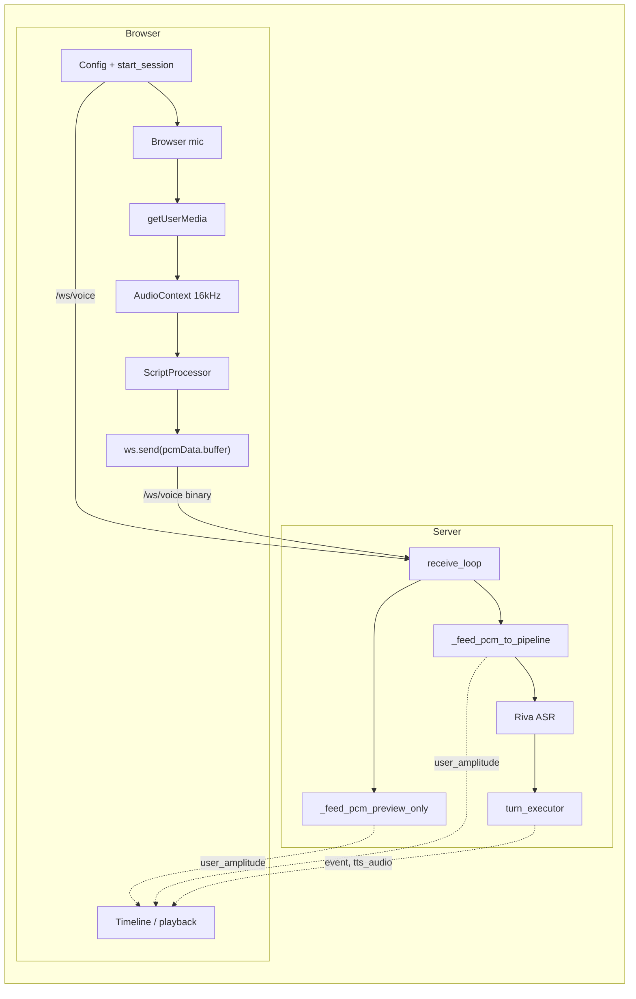
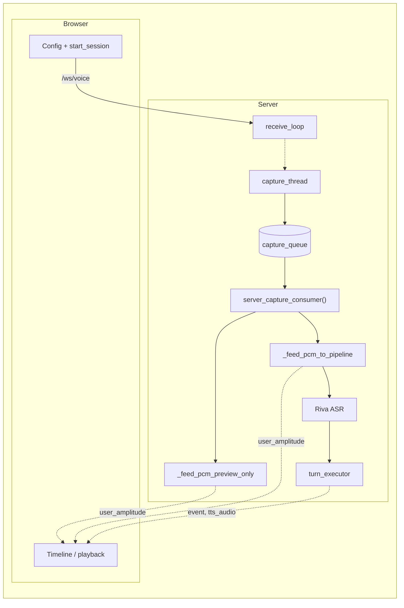
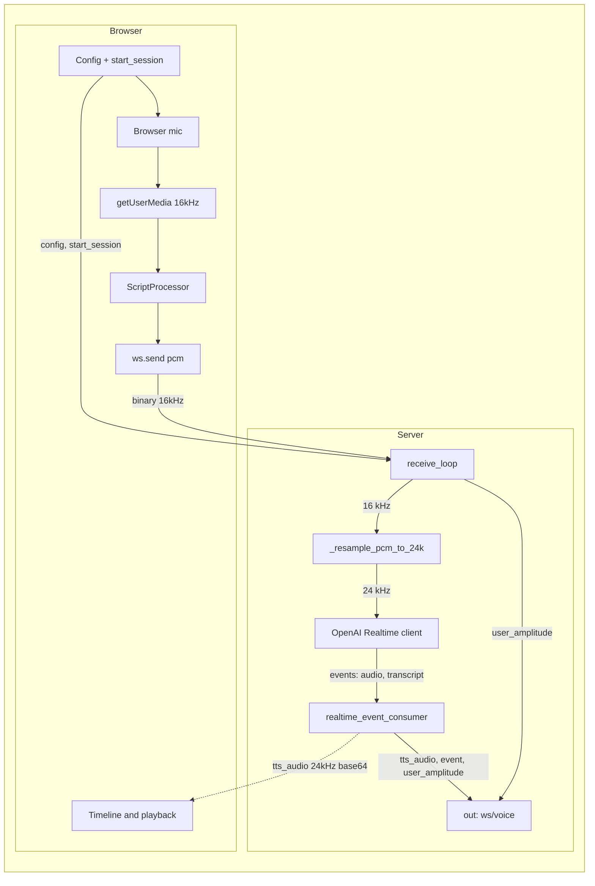

# Audio PCM pipeline trace: Browser mic vs Server USB mic

This document traces how microphone PCM flows through the pipeline for **Browser** and **Server USB** input, with file/line references. For high-level flow and system context, see [architecture.md](architecture.md).

**Refactor status (current implementation):** Server-side duplicate logic has been unified. A single **live** path (`_feed_pcm_to_pipeline`) and single **preview** path (`_feed_pcm_preview_only`) are used by both browser and server mic. Sections **§4.1**, **§4.2**, and **§5** describe the refactored flow; line numbers below refer to the current `voice_pipeline.py` (and `devices/capture.py` where noted).

**Classic Riva path only** (ASR + LLM + TTS). Realtime path has analogous structure but different entry points.

---

## 1. Browser PCM path (end-to-end)

### 1.1 Client (browser)

| Step | Location | What happens |
|------|----------|--------------|
| 1 | `app.js` `startVoiceMicStream()` | If mic is Server USB (`alsa:` / `pyaudio:`), returns early; no browser PCM. Otherwise calls `getUserMedia({ audio })` then `connectPcmToWs(stream)`. |
| 2 | `app.js` `connectPcmToWs(stream)` | Creates `AudioContext` at **16 kHz** (`TARGET_SAMPLE_RATE`), `createMediaStreamSource(stream)`, `createScriptProcessor(2048, 1, 1)`. |
| 3 | `app.js` `processor.onaudioprocess` | Reads float32 from `e.inputBuffer.getChannelData(0)`, converts to **Int16** (clip to ±1, scale to ±0x7FFF/0x8000), then **`ws.send(pcmData.buffer)`** (binary). Chunk = 2048 samples = 4096 bytes @ 16 kHz (~128 ms). |
| 4 | (same) | Optional: client computes RMS for debug / `liveTtlBandStartTime`; **does not** push to `liveAudioAmplitudeHistory` for the AUDIO lane (comment: "use only server user_amplitude"). |

**Summary**: Browser mic → getUserMedia → AudioContext 16 kHz → ScriptProcessor → Int16 PCM → **WebSocket binary** to server. No PCM sent when Server USB mic is selected.

### 1.2 Server (voice_pipeline.py, classic Riva)

| Step | Location | What happens |
|------|----------|--------------|
| 1 | `voice_pipeline.py` | `use_server_mic = False` (browser mic). Session starts when client sends `start_session` (~314–318). |
| 2 | `voice_pipeline.py` ~332–362 | `receive_loop()` runs; no `server_capture_task`. For **BINARY** messages: **`if not use_server_mic`** → if no session start yet: **`_feed_pcm_preview_only(msg.data, ...)`** (~343); else **`_feed_pcm_to_pipeline(msg.data, ...)`** (~347) (ASR + timeline + user_amplitude). |
| 3 | `voice_pipeline.py` ~246–276 `_feed_pcm_to_pipeline()` | **`await asr.send_audio(pcm_bytes)`**; 25 ms amplitude slices; **`session.timeline.add_audio_amplitude(..., source="user")`**; **`ws.send_str(user_amplitude)`** to client. |
| 4 | `backends/asr/riva.py` `send_audio()` | Puts `audio_chunk` into `_sync_audio_queue`; `_stream_to_riva()` sends to Riva gRPC. |
| 5 | `voice_pipeline.py` `asr_consumer()` | Reads from `asr.receive_results()`; on partial/final: timeline event + `send_event()` to client; finals → `finals_queue`. |
| 6 | `voice_pipeline.py` `turn_executor()` | Pops from `finals_queue`; LLM stream → TTS stream; TTS PCM → `ws.send_str(tts_audio base64)` and/or server speaker. |

**Summary**: WebSocket binary → **receive_loop** → `_feed_pcm_preview_only` or `_feed_pcm_to_pipeline` (single path) → ASR → turn_executor → LLM → TTS → client/speaker.

---

## 2. Server USB mic path (end-to-end)

### 2.1 Client (browser)

| Step | Location | What happens |
|------|----------|--------------|
| 1 | `app.js` `startVoiceMicStream()` | If mic is `alsa:` or `pyaudio:` → **returns early**; no browser PCM stream. Logs "Using Server USB microphone; no browser mic stream". Calls `startMicWaveformFromServer()` (preview waveform from server's `user_amplitude`). |
| 2 | On START | `app.js`: **`state.voiceWs.send(JSON.stringify({ type: 'start_session', config: buildVoiceConfig() }))`**. No binary PCM ever sent for voice. |

**Summary**: No PCM from browser. Client only sends **config**, then **start_session** when user clicks START. Green waveform comes from server `user_amplitude` messages.

### 2.2 Server – capture (devices/capture.py)

| Step | Location | What happens |
|------|----------|--------------|
| 1 | `voice_pipeline.py` ~191–198 | `use_server_mic = True`; creates `capture_queue`, `stop_capture`; **`start_server_mic_capture(source, device, capture_queue, stop_capture)`** starts a **thread**. |
| 2 | `devices/capture.py` ~160–195 `start_server_mic_capture()` | Dispatches to **`_capture_alsa(device, ...)`** or **`_capture_pyaudio(device_index_str, ...)`**. |
| 3 | `_capture_alsa` ~23–82 | Runs **`arecord -D plughw:X,Y -f S16_LE -r 16000 -c 1 -t raw`**; reads **CHUNK_BYTES (4096)** in a loop; **`out_queue.put(chunk)`**. On stop or error, **`out_queue.put(None)`**. |
| 4 | `_capture_pyaudio` ~99–157 | **PyAudio** `open(..., rate=16000, frames_per_buffer=CHUNK_SAMPLES=2048)`; **`stream.read(CHUNK_SAMPLES)`** → **`out_queue.put(data)`**. Same chunk size as browser (2048 samples = 4096 bytes). |

**Summary**: ALSA or PyAudio thread produces **16 kHz, 16-bit mono** chunks into **capture_queue**. Same format and size as browser chunks.

### 2.3 Server – pipeline (voice_pipeline.py)

| Step | Location | What happens |
|------|----------|--------------|
| 1 | `voice_pipeline.py` | **`pipeline_live`** is set only when client sends **start_session** (~317). Until then, capture is preview-only. |
| 2 | `voice_pipeline.py` ~671–710 `server_capture_consumer()` | Async task: **`chunk = await loop.run_in_executor(None, capture_queue.get)`** (~683). If **`pipeline_live.is_set()`**: **`_feed_pcm_to_pipeline(chunk, ...)`** (~699; same as browser live). If not live: **`_feed_pcm_preview_only(chunk, ...)`** (~706; same as browser preview). |
| 3 | `voice_pipeline.py` ~341 `receive_loop()` | For **BINARY** messages: **`if not use_server_mic`** is false when server mic → branch skipped; browser PCM is ignored. |
| 4 | ASR / turn_executor | Identical to browser path: same `asr_consumer()`, same `turn_executor()`, same Riva ASR → LLM → Riva TTS. |

**Summary**: PCM comes from **capture_queue** (filled by capture thread). **server_capture_consumer** uses the same **`_feed_pcm_to_pipeline`** (live) and **`_feed_pcm_preview_only`** (preview) as the browser path.

---

## 3. Side-by-side: where the paths differ and where they are the same

| Stage | Browser PCM | Server USB mic |
|-------|-------------|----------------|
| **Source of PCM** | WebSocket binary in `receive_loop()` | `capture_queue` in `server_capture_consumer()` |
| **When PCM flows** | As soon as WS is open and client sends PCM (preview before START; live after start_session) | Capture thread runs always; preview before start_session, live after |
| **Session start** | `session.start()` when client sends **start_session** (~314–318) | Same: **start_session** sets `pipeline_live` (~317) and `session.start()` |
| **Per-chunk handling** | `receive_loop`: `_feed_pcm_preview_only()` or `_feed_pcm_to_pipeline()` | `server_capture_consumer`: same **`_feed_pcm_preview_only()`** / **`_feed_pcm_to_pipeline()`** |
| **ASR** | Same `RivaASRBackend`, same `asr_consumer()` | Same |
| **LLM + TTS** | Same `turn_executor()` | Same |
| **TTS output** | Same (browser base64 and/or server speaker) | Same |

The **only** difference is **who produces the bytes** (browser vs capture thread). Both paths feed the **same** helpers: `_feed_pcm_preview_only` (preview) and `_feed_pcm_to_pipeline` (live).

---

## 4. Duplicate / redundant parts

### 4.1 Single feed path — **refactored** (current implementation)

**"Feed PCM to ASR + record amplitude + send user_amplitude to client"** is implemented in **two shared helpers** (no per-mic duplication):

- **`_feed_pcm_to_pipeline(pcm_bytes, last_amplitude_time, amplitude_interval)`** (~246–276): calls `asr.send_audio(pcm_bytes)`, computes 25 ms amplitude slices, `session.timeline.add_audio_amplitude(..., source="user")`, `ws.send_str(user_amplitude)`.
- **Preview-only**: **`_feed_pcm_preview_only(...)`** (~220–245): same amplitude logic, no ASR, no timeline; used when session not started.

**Call sites:**
- **Browser:** `receive_loop()` ~343 / ~347: if `session.timeline.start_time is None` → `_feed_pcm_preview_only`, else `_feed_pcm_to_pipeline`.
- **Server USB:** `server_capture_consumer()` ~696–707: if `pipeline_live.is_set()` → `_feed_pcm_to_pipeline`, else `_feed_pcm_preview_only`.

No remaining duplication for per-chunk ASR + amplitude + user_amplitude.

### 4.2 Preview vs live — **refactored** single path for overlay

- **Preview** (before start_session): Both mics use **`_feed_pcm_preview_only()`** — user_amplitude only (no ASR, no timeline). Browser: `receive_loop` gets BINARY, calls `_feed_pcm_preview_only`. Server USB: `server_capture_consumer` calls `_feed_pcm_preview_only` when not `pipeline_live`. Same 25 ms throttle and scale.
- **Live** (after start_session): Both use **`_feed_pcm_to_pipeline()`** (ASR + timeline + user_amplitude).

**Client preview overlay:** Overlay is driven by server **user_amplitude** for both mics; ring filled in `handleVoiceWsMessage`. Browser mic: client sends PCM when overlay is shown (before START), so waveform appears before session start.

### 4.3 Amplitude data stored in two places (already in ARCHITECTURE.md)

- **Server**: `session.timeline` gets `audio_amplitude` events (user and tts).
- **Client**: Builds `liveAudioAmplitudeHistory` from server's `user_amplitude` messages; on stop sends `audio_amplitude_history` back; server stores it on session and saves to JSON. Replay merges timeline + `session.audio_amplitude_history`. So user amplitude is both in timeline events and in the client-sent list — **data** duplication, not only code.

---

## 5. Diagrams (Mermaid) – post-refactor §4.1

All diagrams use the **intended** layout **after** the refactor in §4.1: both input paths (browser PCM and server capture) feed the same two helpers — **`_feed_pcm_preview_only`** (preview) and **`_feed_pcm_to_pipeline`** (live). The same **/ws/voice** WebSocket is used in both modes.

### 5.0 WebSocket message types (/ws/voice)

We did not previously document the full set of message types in one place. Here they are.

**Client → server (TEXT, JSON):**

| Message | When sent | Purpose |
|--------|-----------|--------|
| `{ "type": "config", "config": { ... } }` | **First message** after the WebSocket opens (in both Browser and Server Mic). Client sends this in `ws.onopen` using `buildVoiceConfig()`. | Server requires this to initialize the session (devices, ASR/TTS/LLM settings). Server merges into `session.config`. |
| `{ "type": "start_session", "config": { ... } }` | When the user clicks **START**. Config is optional but usually included so the saved session has the latest devices (e.g. speaker changed after preview). | Server merges config if present, calls `session.start()`, and (Server Mic only) sets `pipeline_live`. |
| `{ "type": "stop", ... }` | When the user clicks **STOP**. May include `system_stats`, `tts_playback_segments`, `audio_amplitude_history`, `ttl_bands`, etc. | Server saves payload onto session and closes the pipeline. |

**Client → server (BINARY):** PCM chunks (Int16, 16 kHz) — **only in Browser Mic mode**, and only after START. In Server Mic mode the client never sends binary.

**When is config sent?** Config is **not** pushed on every UI change. It is sent (1) **once** when the voice WebSocket opens (`type: 'config'`), and (2) **again** when the user clicks START, inside the `start_session` payload. So if you change mic or speaker in the UI and then click START, the server gets the updated config with start_session. If you change something mid-session without reconnecting, the server does not see it until the next START or reconnect.

**Server → client (TEXT, JSON):** All on the same /ws/voice. Types: `event` (timeline events: asr_partial, asr_final, llm_start, tts_start, tts_audio, etc.), `user_amplitude` (timestamp + amplitude for green waveform), `tts_audio` (base64 PCM), `error`, `tts_start`. Server never sends raw PCM; it sends derived data (event, user_amplitude, tts_audio).

### 5.1 Browser Mic mode

**Same as §5.2 for the start:** Client opens /ws/voice and sends **config** (first message), then **start_session** when the user clicks START. After that, in Browser Mic the client also sends **binary PCM** over the same WebSocket. The server sends back **event**, **user_amplitude**, and **tts_audio** on the same /ws/voice; the browser uses these for the **Timeline** and TTS playback. Attribution: **user_amplitude** from `_feed_pcm_preview_only` (preview) or `_feed_pcm_to_pipeline` (live); **event** and **tts_audio** from TE (and events from asr_consumer).

**Diagram:** Browser left, Server right; flow starts with **Config + start_session** (same as §5.2), then Browser Mic adds PCM. Horizontal arrows = WebSocket. RECV routes binary PCM to **preview** (no session) or **live** (session started); only the live path feeds ASR.

### 5.2 Server Mic mode

No PCM from the browser. The client sends **config** then **start_session** on /ws/voice. PCM comes from a **capture thread** (ALSA/PyAudio) into **server_capture_consumer**, which feeds the same two helpers (**`_feed_pcm_preview_only`** / **`_feed_pcm_to_pipeline`**) as in Browser Mic mode. The server still sends **event**, **user_amplitude**, and **tts_audio** over the **same** /ws/voice so the browser **Timeline** and playback update.

**receive_loop:** It is the single reader for everything the client sends on /ws/voice—TEXT (config, start_session, stop) and, in Browser Mic mode, BINARY (PCM). So using it for config + start_session in Server Mic mode is not repurposing; we simply do not receive any BINARY in that mode. One loop, one WebSocket; the client just sends different message types depending on mode. **In Server Mic mode, receive_loop (on the server) receives config and start_session from the browser and starts the capture thread**; PCM then flows from the capture thread into the pipeline (CQ → SCC → _feed_pcm_preview_only / _feed_pcm_to_pipeline), not over the wire.

**Where server→client messages come from (all over the same /ws/voice):**
- **user_amplitude** — from **`_feed_pcm_preview_only`** (preview) or **`_feed_pcm_to_pipeline`** (live), which process each PCM chunk (from SCC or from receive_loop in browser mic mode), compute amplitude, and send `user_amplitude` on the WebSocket.
- **event** — from several places: **receive_loop** (session_start when start_session is processed), **asr_consumer** (asr_partial, asr_final), and **turn_executor** (llm_start, llm_first_token, llm_complete, tts_start, tts_first_audio, tts_complete). Events are emitted along the pipeline.
- **tts_audio** — from **turn_executor** when it runs the TTS loop (after LLM, it streams TTS chunks and sends each as `tts_audio` on the WebSocket).

**Diagram:** Same convention; horizontal arrows = WebSocket traffic. The dotted arrow **RECV → CAP** indicates that receive_loop, on receiving config/start_session from the browser, starts the capture thread. SCC routes PCM to **preview** (when not pipeline_live) or **live** (when pipeline_live); only the live path feeds ASR.

So in Server Mic mode the browser sends no PCM; it only sends config and start_session and receives event / user_amplitude / tts_audio on the same /ws/voice. PCM never goes over the wire from client.

After **`_feed_pcm_preview_only`** / **`_feed_pcm_to_pipeline`**, the pipeline is identical for both input sources; only the **source of PCM** (receive_loop binary vs server_capture_consumer from CQ) and which helper is used (preview vs live) differ.

---

## 6. File reference summary

| File | Browser path | Server USB path |
|------|-------------|-----------------|
| **app.js** | `startVoiceMicStream`, `connectPcmToWs`, `onaudioprocess` → `ws.send(pcmData.buffer)` | Early return when mic is alsa/pyaudio; `start_session` |
| **voice_pipeline.py** | `receive_loop` BINARY → `_feed_pcm_preview_only` or `_feed_pcm_to_pipeline` (~332–362) | `server_capture_consumer` → same helpers (~696–707); `receive_loop` handles start_session (~291–318) |
| **voice_pipeline.py** (helpers, **refactored**) | `_feed_pcm_preview_only` ~220, `_feed_pcm_to_pipeline` ~246 | Same; both paths call these |
| **devices/capture.py** | — | `start_server_mic_capture`; `_capture_alsa`, `_capture_pyaudio` |
| **backends/asr/riva.py** | `send_audio` (called from `_feed_pcm_to_pipeline`) | Same |
| **voice_pipeline.py** (shared) | `asr_consumer`, `turn_executor` | Same |

Browser and Server USB differ only by **source of PCM** (WebSocket vs capture_queue). Per-chunk handling is unified in `_feed_pcm_preview_only` and `_feed_pcm_to_pipeline` (**refactored**). A separate **/ws/mic-preview** WebSocket (server mic level only, no ASR/LLM/TTS) uses its own inline amplitude in `handle_mic_preview_ws` (~982–1006) and does not use the shared helpers.

---

## 7. Realtime API speech-to-speech PCM

When ASR is **OpenAI Realtime** (`asr.scheme == "openai-realtime"`, `realtime_session_type == "full"`, `realtime_transport == "websocket"`), the server runs **`_run_realtime_loop`** instead of the classic Riva ASR → LLM → TTS pipeline. There is no Riva ASR, LLM, or Riva TTS; a single **OpenAI Realtime WebSocket** handles speech-to-speech: our server sends input PCM and receives back events (transcription, response audio). All traffic with the browser still goes over **/ws/voice** (config, start_session, binary PCM from browser when browser mic, user_amplitude and event/tts_audio from server).

**Sample rates:** Browser and server capture both produce **16 kHz** PCM (same as classic). The Realtime API expects **24 kHz** PCM (`backends/realtime/client.py`: `REALTIME_SAMPLE_RATE = 24000`). The server resamples 16 → 24 kHz before sending to the Realtime client; TTS audio from Realtime is 24 kHz and is sent to the browser as base64 in `tts_audio` (client decodes and plays at 24 kHz).

### 7.1 When Realtime is chosen

| Step | Location | What happens |
|------|----------|--------------|
| 1 | `voice_pipeline.py` ~601–606 | After session and device setup, if `asr_config.scheme == "openai-realtime"` and `realtime_session_type == "full"` and `realtime_transport == "websocket"`, and URL/model (and API key for non-localhost) are set, the server calls **`_run_realtime_loop(...)`** and does not run the classic pipeline. |
| 2 | `voice_pipeline.py` ~618–628 | `_run_realtime_loop` receives the same `ws`, `session`, `config`, `session_dir`, `use_server_mic`, `use_server_speaker`, `capture_queue`, `stop_capture`, `capture_thread` as the classic path would. Device capture (if server mic) is already started by the common code above. |

### 7.2 Input PCM: browser mic (Realtime)

| Step | Location | What happens |
|------|----------|--------------|
| 1 | `app.js` | Same as classic Browser Mic: client sends **config** then **start_session**; after that it sends **binary PCM** (Int16, 16 kHz) over /ws/voice. No change in client behavior for Realtime. |
| 2 | `voice_pipeline.py` ~411–430 `receive_loop()` | On **BINARY** message (and `not use_server_mic`): **`await session_ready.wait()`** (do not send until Realtime session is ready). **`pcm_24 = pcm_for_realtime(msg.data)`** (~413): resamples 16 kHz → 24 kHz via **`_resample_pcm_to_24k(msg.data, INPUT_SAMPLE_RATE_FOR_REALTIME)`** (~247–248; `INPUT_SAMPLE_RATE_FOR_REALTIME = 16000` ~162). Optional debug: **`_write_debug_pcm(pcm_24)`**. **`await client.send_audio(pcm_24)`** (~415): pushes base64-encoded PCM to the Realtime client's input buffer; client sends to OpenAI. |
| 3 | `voice_pipeline.py` ~416–429 | User amplitude (green waveform): **`amp = _pcm_rms_to_amplitude(msg.data)`** on the **original 16 kHz** chunk; throttled at **`amplitude_interval = 0.05`** (~219); **`session.timeline.add_audio_amplitude(amplitude=amp, source="user")`**; **`ws.send_str({"type": "user_amplitude", "timestamp": ..., "amplitude": ...})`** to browser. Smoothed with a 3-sample buffer. **Realtime does not use** `_feed_pcm_preview_only` or `_feed_pcm_to_pipeline`; it has its own inline amplitude logic. |

**Summary:** Browser → 16 kHz binary on /ws/voice → server resamples to 24 kHz → Realtime client → OpenAI. User amplitude is computed on the 16 kHz chunk and sent to the browser at 50 Hz; same timeline and message shape as classic for the green waveform.

### 7.3 Input PCM: server USB mic (Realtime)

| Step | Location | What happens |
|------|----------|--------------|
| 1 | `voice_pipeline.py` ~438–482 `server_capture_consumer()` | Same **capture_queue** as classic: 16 kHz chunks from `devices/capture.py` (ALSA or PyAudio). **`chunk = await loop.run_in_executor(None, capture_queue.get)`** (~447). When **`pipeline_live.is_set()`** (~453): **`pcm_24 = pcm_for_realtime(chunk)`** (~455), **`_write_debug_pcm(pcm_24)`**, **`await client.send_audio(pcm_24)`** (~456); then user amplitude from **`_pcm_rms_to_amplitude(chunk)`** (16 kHz), throttle 0.05 s, timeline + **user_amplitude** to browser (~468–471). When not live (~474–482): preview-only **user_amplitude** (no timeline, no send_audio). **Realtime does not use** `_feed_pcm_preview_only` or `_feed_pcm_to_pipeline`; server_capture_consumer has its own branch. |
| 2 | Session start | For server mic, **`pipeline_live`** is cleared initially (~214). When the browser sends **start_session**, receive_loop (~392–396) sets **`session.start()`**, **`send_event(session_start)`**, **`pipeline_live.set()`**. After that, server_capture_consumer sends PCM to the Realtime client and records user amplitude. |

**Summary:** Capture thread → 16 kHz → server_capture_consumer → resample to 24 kHz → Realtime client; user amplitude from 16 kHz chunk, same 50 Hz and timeline/user_amplitude as browser mic Realtime path.

### 7.4 Resampling 16 → 24 kHz

| Step | Location | What happens |
|------|----------|--------------|
| 1 | `voice_pipeline.py` ~150–158 `_resample_pcm_to_24k()` | **`samples = np.frombuffer(pcm_bytes, dtype=np.int16)`**; **`n_new = int(round(n_old * REALTIME_SAMPLE_RATE / from_rate))`** (24k/16k → 1.5× samples); linear interpolation **`np.interp(x_new, x_old, samples.astype(np.float64)).astype(np.int16)`**; returns bytes. Used by **`pcm_for_realtime(pcm_bytes)`** (~247–248) with **`INPUT_SAMPLE_RATE_FOR_REALTIME = 16000`** (~162). |

### 7.5 Realtime output: TTS audio and timeline

| Step | Location | What happens |
|------|----------|--------------|
| 1 | `backends/realtime/client.py` | Realtime client **`events()`** yields **`RealtimeEvent`** with **`kind="audio"`**, **`ev.audio`** (bytes, 24 kHz PCM), **`ev.sample_rate`** (24000). No separate Riva TTS; OpenAI returns response audio on the same WebSocket. |
| 2 | `voice_pipeline.py` ~288–368 `realtime_event_consumer()` | **`async for ev in client.events()`**. On **`ev.kind == "audio"` and `ev.audio`**: optional **`_write_debug_response_audio(ev.audio)`**; timeline events **tts_start** / **tts_first_audio** (first chunk); **`pending_tts_amp = _pcm_rms_to_amplitude(ev.audio)`** when **`ts - last_tts_amplitude_time >= tts_amplitude_interval`** (0.05 s). If server speaker: write **ev.audio** to server playback process. **`b64 = base64.b64encode(ev.audio)`**; then **`ts_send = time.time() - session.timeline.start_time`**; **`session.timeline.add_audio_amplitude(amplitude=pending_tts_amp, source="tts", timestamp=ts_send)`** (one sample per chunk at handoff time); **`await ws.send_str({"type": "tts_audio", "data": b64, "sample_rate": ev.sample_rate, "is_final": False})`**. Realtime does **not** send **amplitude_segments** in tts_audio; the browser derives live purple from decoded PCM (e.g. 25 ms windows in app.js). Replay uses server timeline **audio_amplitude** (source=tts). |

**Summary:** Realtime API → 24 kHz PCM events → server base64-encodes, adds one TTS amplitude sample per chunk (at send time), sends **tts_audio** on /ws/voice; optional server speaker playback. Browser plays at 24 kHz and builds live purple from PCM; saved session has server-authored TTS amplitude in the timeline.

### 7.6 Realtime vs classic: side-by-side

| Stage | Classic (Riva) | Realtime (OpenAI) |
|-------|----------------|-------------------|
| **Entry** | `_run_voice_pipeline` → `receive_loop` + `asr_consumer` + `turn_executor` | `_run_realtime_loop` → `realtime_event_consumer` + `receive_loop` + optional `server_capture_consumer` |
| **Input PCM source** | Same: browser binary or capture_queue | Same |
| **Input rate** | 16 kHz (no resample) | 16 kHz → **resampled to 24 kHz** before sending to upstream |
| **Upstream** | Riva ASR (gRPC) + LLM + Riva TTS | Single Realtime WebSocket (OpenAI); ASR + LLM + TTS inside API |
| **User amplitude** | **`_feed_pcm_preview_only`** / **`_feed_pcm_to_pipeline`** (25 ms slices, timeline + user_amplitude) | Inline in receive_loop / server_capture_consumer (50 Hz, **`_pcm_rms_to_amplitude`** on 16 kHz chunk, timeline + user_amplitude) |
| **TTS output** | turn_executor: TTS stream → base64 + **amplitude_segments** (25 ms) in tts_audio | realtime_event_consumer: ev.audio → base64, **no amplitude_segments**; one **add_audio_amplitude(..., ts_send)** per chunk (~50 ms) |
| **Live purple (browser)** | **All from server:** `voice_pipeline.py` sends **amplitude_segments** in each tts_audio; browser pushes them to `liveTtsAmplitudeHistory` and does not compute from PCM. | **Fallback:** Server does not send amplitude_segments; browser uses **ttsChunkToAmplitudeSegments** (25 ms windows) on decoded PCM to build live purple. |
| **Replay purple** | Timeline **audio_amplitude** (source=tts) from server | Same: timeline **audio_amplitude** (source=tts); density lower (one per ~50 ms) |

### 7.7 Diagram: Realtime path (browser mic)

### 7.8 File reference (Realtime)

| File | Role |
|------|------|
| **voice_pipeline.py** | **~601–628**: choose Realtime vs classic; **~165–548** `_run_realtime_loop`: pcm_for_realtime (~247), receive_loop (~384), server_capture_consumer (~438), realtime_event_consumer (~288); **~150–158** `_resample_pcm_to_24k`; **~162** `INPUT_SAMPLE_RATE_FOR_REALTIME`. |
| **backends/realtime/client.py** | **OpenAIRealtimeClient**: connect, send_audio (24 kHz PCM), events(); **REALTIME_SAMPLE_RATE = 24000**. |
| **app.js** | Same as classic: config, start_session, binary PCM at 16 kHz; handles event, user_amplitude, tts_audio (including 24 kHz from Realtime); live purple from **ttsChunkToAmplitudeSegments** when no amplitude_segments. |
| **devices/capture.py** | Same as classic when server mic: 16 kHz chunks into capture_queue; consumed by server_capture_consumer in Realtime path. |
