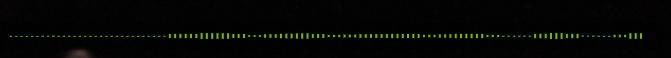
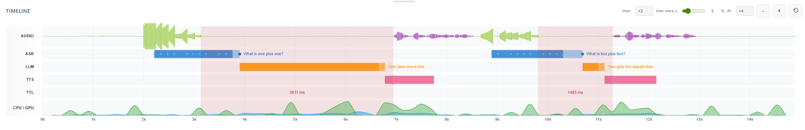
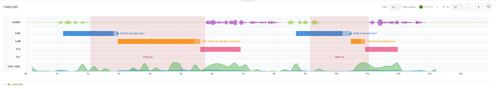
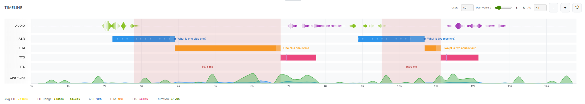
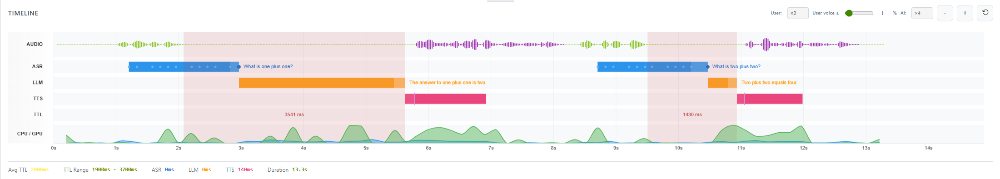

# Saw-like user amplitude waveform: analysis and fix

## Observed behavior (user / green waveform)

Behavior depends on **microphone source** (browser vs server).

**Browser mic:** Preview smooth; **live** saw-tooth (~128 ms ramps then reset); replay smooth.

**Server mic:** Preview smooth (scroll can be a little sluggish); **live** smooth; replay smooth.

Same `user_amplitude` WebSocket messages; the difference is rendering (preview vs live vs replay) and, for live, chunk timing (browser-sent PCM vs server capture), which produces the saw with browser mic but not with server mic.

**Screenshots (green user waveform)**

| Mode | Browser mic | Server mic |
|------|-------------|------------|
| **Preview** |  Smooth |  Smooth (scroll can be sluggish) |
| **Live** |  Saw-tooth |  Smooth |
| **Replay** |  Smooth |  Smooth |

---

## 1. Server: same amplitude logic in both paths

Both paths use the same helpers and per-chunk loop.

| Aspect | `_feed_pcm_preview_only()` | `_feed_pcm_to_pipeline()` |
|--------|----------------------------|----------------------------|
| **When used** | Before session start (preview only) | After session start: browser mic (PCM over WS) or server mic (capture) |
| **Time base** | `now = time.time() - connection_start_time` | `now = time.time() - session.timeline.start_time` |
| **RMS / slices** | `_pcm_rms_slices(pcm_bytes, ..., window_s=0.025)` | Same |
| **Per-slice timestamp** | `t = now - (len(amplitudes)-1-i)*0.025 - 0.0125` | Same |
| **Throttle** | `t - last_amplitude_time >= 0.025` | Same |
| **Monotonic clamp** | `t = max(t, last_amplitude_time + 0.025)` | Same |
| **WS message** | `{"type":"user_amplitude","timestamp":t,"amplitude":amp}` | Same |

The payload (timestamp, amplitude) is produced the same way; the only difference is the meaning of `now` (connection-relative vs session-relative).

---

## 2. Why 128 ms? (browser mic and the saw)

With **server mic**, capture chunk size is fixed (128 ms per chunk in `devices/capture.py`); each chunk yields 5 amplitude samples. With **browser mic**, chunk size and arrival timing depend on the client. When that timing produces gaps (e.g. similar to the 128 ms pattern), the pipeline only sends when `t - last_amplitude_time >= 0.025`, so we get timestamp gaps and the amplitude at the next sample is often lower (start of new chunk) → ramp then drop → saw. With **server mic**, the fixed 128 ms cadence can yield a more regular timestamp stream, so live is observed smooth.

---

## 3. Why preview (green) looks fine

Preview and timeline consume the same WebSocket stream but render differently:

| | **Preview (green)** | **Timeline (green, live)** |
|---|---------------------|--------------------------|
| **Data** | Same `user_amplitude` messages | Same, plus `liveAudioAmplitudeHistory` and server timeline |
| **Buffer** | `state.micAmplitudeBuffer`: ring of amplitude only (no timestamps) | `liveAudioAmplitudeHistory`: `{ timestamp, amplitude }[]` |
| **X-axis** | **Index**: `x = waveformLeft + j * step`, `step = width / (ring.length-1)` | **Time**: `x = visibleLeft + (t - timelineOffset) * timeScale`, `t` every 0.025 s |
| **Height** | `ring[j]` (one value per bar) | `getAmplitudeAtTime(history, t)` (interpolate between samples) |
| **Per message** | Push 3 copies of same amplitude (`samplesPerMessage = 3`) | Push 1 `{ timestamp, amplitude }`; timeline samples at fixed 25 ms grid |

- **Preview:** No time axis; bars are evenly spaced by index. Gaps and chunk boundaries do not appear on the X-axis. Repeating the same amplitude 3× also smooths the strip.
- **Timeline:** Renders by time. Gaps (e.g. 0.1 → 0.1435) are visible; `getAmplitudeAtTime` interpolates between the last sample of one chunk (high) and the first of the next (low) → visible drop → saw.

**Raw resolution:** There are 25 ms windows (5 per 128 ms chunk). The issue is that the emitted `(timestamp, amplitude)` stream does not have a uniform time axis: the client only sends when `t` advances by ≥25 ms from the last send, and `t` is derived from chunk arrival time, so there is a ~43 ms gap between the last sample of one chunk and the first of the next. The timeline data has gaps; the underlying 25 ms RMS computation does not.

The saw comes from timeline rendering (time-based sampling + linear interpolation across chunk-boundary gaps), observed with **browser mic** (live); with **server mic**, live is observed smooth.

**Live vs replay:** On replay, the green user waveform is smooth. Bar count in 1 s: preview ~60; timeline 40 (fixed `tStep = 0.025`).

---

## 4. Side-by-side code (server)

```python
# _feed_pcm_preview_only (lines 220–246)
now = time.time() - connection_start_time
amplitudes = _pcm_rms_slices(pcm_bytes, sample_rate=16000, window_s=_amplitude_window_s)
for i, a in enumerate(amplitudes):
    t = now - (len(amplitudes) - 1 - i) * _amplitude_window_s - _amplitude_window_s / 2
    if t < 0: continue
    if t - last_amplitude_time >= amplitude_interval:
        t = max(t, last_amplitude_time + amplitude_interval)
        last_amplitude_time = t
        # ... send user_amplitude

# _feed_pcm_to_pipeline (lines 248–278)
now = time.time() - session.timeline.start_time
await asr.send_audio(pcm_bytes)
amplitudes = _pcm_rms_slices(pcm_bytes, sample_rate=16000, window_s=_amplitude_window_s)
for i, a in enumerate(amplitudes):
    t = now - (len(amplitudes) - 1 - i) * _amplitude_window_s - _amplitude_window_s / 2
    if t < 0: continue
    if t - last_amplitude_time >= amplitude_interval:
        t = max(t, last_amplitude_time + amplitude_interval)
        last_amplitude_time = t
        session.timeline.add_audio_amplitude(amplitude=amp, source="user", timestamp=t)
        # ... send user_amplitude (same JSON)
```

Only differences: time base (`connection_start_time` vs `session.timeline.start_time`) and pipeline also calls ASR and timeline. The loop and message shape are the same.

---

## 5. Possible fixes (explored, no good fix yet)

The saw only affects **browser mic** during **live**; **server mic** live is smooth. So a practical workaround is to use the server mic when a smooth live user waveform matters.

Fixing only on the server (e.g. emitting on a strict 25 ms grid) would still leave replay and other consumers of stored `(t, amplitude)` with the same chunk-boundary pattern. The more robust place to remove the saw would be how the timeline draws user amplitude. The following options were considered; so far none has yielded a satisfactory fix:

1. **Do not interpolate across large gaps**  
   In `getAmplitudeAtTime` (or in the timeline draw loop), if `t1 - t0 > GAP_THRESHOLD` (e.g. 50 ms), treat the segment as a gap: do not interpolate; use 0 or hold the previous value. Avoids a steep drop over the gap but can introduce other artifacts or flat segments.

2. **Smooth or cap the drop**  
   When interpolating, cap the rate of change (e.g. max decrease per 25 ms) so chunk-boundary drops do not look like a reset. Tuning the cap without making the waveform laggy or wrong is difficult.

3. **Time-grid alignment**  
   Snap sample times to a 25 ms grid before interpolating. Can reduce visible resets but does not fully remove the saw when gaps are irregular.

**Current status:** No client- or server-side change has been adopted that cleanly removes the browser-mic live saw. Using the **server mic** gives a smooth live user waveform; replay is smooth for both mic sources.

---

## 6. Optional server-side improvement (not implemented)

For more regular timestamps on the wire and in the timeline store:

- In `_feed_pcm_to_pipeline`, advance a running `last_amplitude_time` by exactly `amplitude_interval` (25 ms) for each emitted sample, instead of using `t` derived from `now - (…)`. That would yield a strict 25 ms grid and no gaps, independent of 128 ms chunk boundaries.

This has not been implemented. It could help consistency and smaller gaps in stored data; whether it would remove the browser-mic live saw depends on how the browser sends PCM (chunk size and timing).

---

## 6b. Amplitude scale (user and TTS)

**Server:** Both user and TTS amplitude are stored on a 0–100 scale. User: `_pcm_rms_slices` → `min(100, (rms/32768)*100)`. TTS: same helper on each TTS audio chunk. Values can be 0–100 (and often lower, e.g. 0–15 for TTS).

**Client:** The UI draws bar height as `(amp / 100) * maxBarHalf` and applies `userGain` / `aiGain` (e.g. ×1/×2/×4). Amplitude is therefore treated as 0–100. For backward compatibility, if all amplitude values in a timeline list are in (0, 1], the series is treated as 0–1 and multiplied by 100 once; if any value is > 1, the series is assumed 0–100 and is not scaled. That avoids wrongly boosting small 0–100 values (e.g. 0.36) to 36 and making the waveform look spikey.

---

## 7. Recorded session: TTS (purple) waveform = actual amplitude only

The client must not draw a full-amplitude purple block for the entire TTS duration. Purple is drawn only where `audio_amplitude` (source tts/ai) data exists, using the actual amplitude at each time (no segment clipping). Concretely: draw only for `t` in `[first amplitude timestamp, last amplitude timestamp]` and set bar height from `getAmplitudeAtTime(ttsFromTimeline, t)`. There is no requirement to stay inside `tts_start`…`tts_complete`; the recorded TTS amplitude is drawn where it exists. Gaps between turns (e.g. >0.1 s between samples) are treated as no data (`getAmplitudeAtTime(..., maxGapSec)` returns 0) so no purple is drawn between turns.
